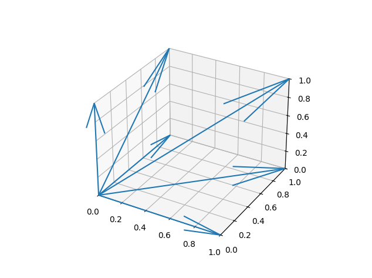
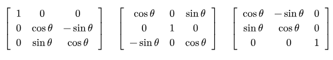
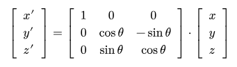
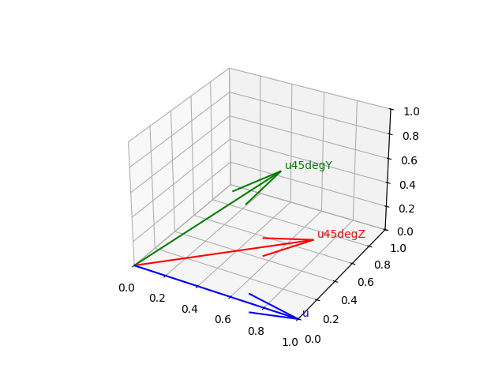
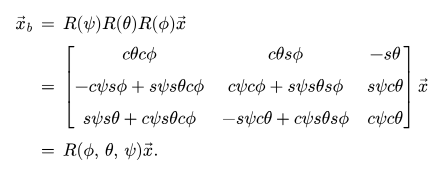
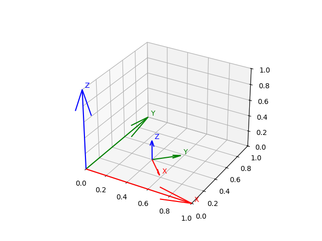

### vectors3D.py
Here is a simple exercise to get familiar with vectors in 3D  

  

### rotation_matrices.py
A simple exercise to get familiar with rotation matrices and vector rotation transformations  

The rotation matrices for *x*, *y*, and *z* axes are, respectively:  
  

The rotation transformation for the *x*-axis to a new position can be obtained like so:  
  

The exercise plot:  
  

### Rotate_frame.py
A simple exercise to create rotations on coordinate frames with relation to another  

The resulting rotation matrix can be achieved by multiplying the rotation matrices from all the axis   

  

The exercise plot:  

  
